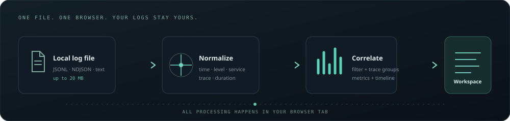

<div align="center">
  
  <h1>TraceLens</h1>
  <p><strong>Find the signal in the incident.</strong></p>
  <p>A private, local-first log explorer that turns JSONL and plain-text events into a filterable timeline, service view, and trace-level incident context.</p>
  <p>
    
    
    
  </p>
</div>

<p align="center"></p>

## Why TraceLens?

During an incident, useful evidence is often spread across services and log formats. TraceLens gives a developer one file to open and one workspace to search, correlate and inspect. It's intentionally static: logs are parsed in the browser tab and are never uploaded to a service.

## Run it

No package install or build step is needed. The sample incident loads automatically.

```bash
git clone https://github.com/Dhwaj1108/tracelens.git
cd tracelens
python3 -m http.server 8000
```

Open [http://localhost:8000](http://localhost:8000). To review your own logs, choose **Import logs** or drop a `.jsonl`, `.ndjson`, `.log` or `.txt` file onto **Bring your own logs**. The app accepts files up to 20 MB.

> ES modules are blocked by browsers on `file://` pages, so serve the folder over localhost as shown above.

## What it does

- **Normalizes** common JSONL fields (time, severity, service, message, trace/span/request IDs and duration) plus a documented plain-text form.
- **Correlates traces** across services and highlights traces with the most errors.
- **Builds an event timeline** with error buckets, searchable messages, service and severity filters, and newest/oldest sorting.
- **Summarizes the current view** with event count, error rate, involved services, and nearest-rank p95 duration.
- **Keeps the raw event one click away** and exports the filtered view back to JSONL.
- **Supports keyboard navigation**: `/` focuses search, ↑/↓ moves through events, Enter inspects, and Esc closes help.
- **Works offline after the files are served**; there are no analytics, API calls, third-party fonts, or runtime dependencies.

See [the format reference](docs/data-format.md) for field aliases, timestamps, and the text-log grammar.

## Design notes

| Decision | Reason |
| --- | --- |
| Static browser app | No account, server, database, or build chain is needed to inspect a file. |
| Local-only parsing | Application logs can contain sensitive operational details; upload is not part of the workflow. |
| Keep the raw event | Normalization should aid navigation without hiding unfamiliar source fields. |
| Explicit text grammar | Guessing arbitrary formats or multiline records can silently corrupt incident evidence. |
| 20 MB cap + progressive rows | Keep imports responsive and DOM work bounded in a browser tab. |
| Zero dependencies | Reduce setup friction and make the data path easy to audit. |

## Architecture

```text
local file → parser.js → normalized events → analytics.js → app.js → incident workspace
                 ↘ raw source retained for detail view and JSONL export
```

`parser.js` handles aliases, UTC normalization and row diagnostics. `analytics.js` computes the metrics and trace groups from normalized events. `app.js` owns the in-memory view state, filtering, rendering, keyboard interactions and file export. The UI has no persistence layer.

## Limits and next steps

TraceLens is a focused incident-view prototype. It doesn't ingest OTLP/protobuf, infer arbitrary text formats, interpret multiline stack traces, or persist sessions. The import limit and visible-row cap are deliberate; larger investigations should first be split into useful time windows. A natural next step is a streaming parser backed by a Web Worker, followed by saved, shareable *filter presets* that never contain log contents.

## Contributing

See [CONTRIBUTING.md](CONTRIBUTING.md). Sample data is synthetic and contains no real customer information.

## License

[MIT](LICENSE)
